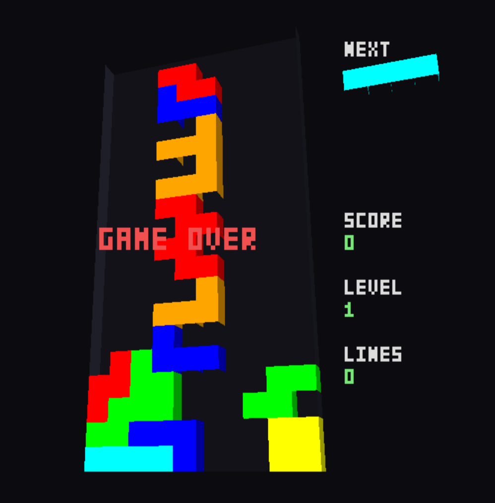

# Blockgame

A software rendered 3D game about falling blocks, written in Go++, that uses SDL3.

Tested on Linux.

### Requires

* [Go++](https://github.com/vmaxer/gooop)

### Building

    make

To cross-compile a Windows executable from Linux you need a mingw-w64
toolchain and the SDL3 mingw libraries, then run:

    make win64

This produces `blockgame.exe`. Ship `SDL3.dll` alongside it to run on Windows.

### Running

    ./blockgame

### General info

* Version: 1.0.0
* License: The Unlicense
